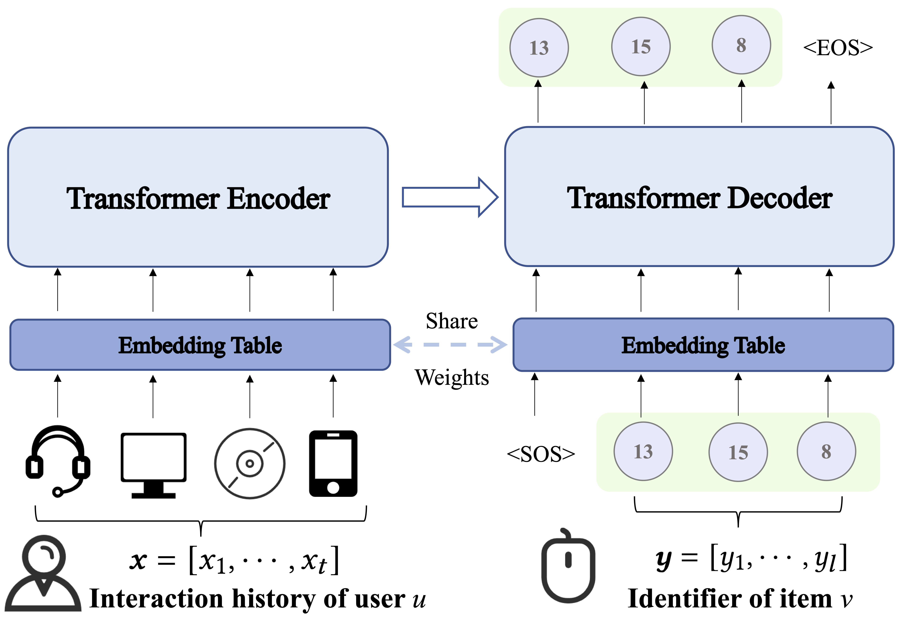
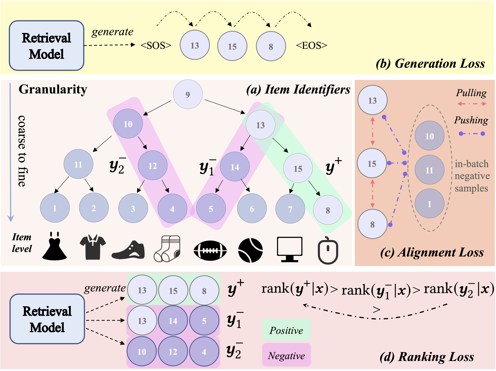

# Generative Retrieval with Semantic Tree-Structured Item Identifiers via Contrastive Learning

This is the official implementation of the paper "Generative Retrieval with Semantic Tree-Structured Item Identifiers via Contrastive Learning" based on PyTorch. [[Arxiv]](https://arxiv.org/pdf/2309.13375) [[ACM]](https://dl.acm.org/doi/10.1145/3673791.3698408)

## Overview

We introduce a novel generative retrieval framework named **SEATER**,  which learns **SE**m**A**ntic **T**ree-structured item identifi**ER**s using an encoder-decoder structure. 

The key implementation of SEATER can be found in `./model/SEATER.py`.
The overview is illustrated as follows:

|  |  |
|------------------------|------------------------|


## Reproducibility

Here we share the code, data and some experiments for reproducibility on the public datasets.

### Experimental Settings

All the hyper-parameters of models can be found in `./config/`.
We list the details of datasets in `./config/const.py`, such as item count, user count, maximum history length for user modeling. The essential model-agnostic hyper-parameters like 'batch size' and 'the number of epochs' are listed in `main.py`.

### Datasets

The data and corresponding SEATER's checkpoints can be downloaded from this link [https://1drv.ms/u/s!AuS9Xkv_PPtMhk5brWLFIo-KgfPt?e=wDZEaf](https://1drv.ms/u/s!AuS9Xkv_PPtMhk5brWLFIo-KgfPt?e=wDZEaf). After downloading, place the extracted files in the corresponding locations within the './data' folder.

### Requirements
```
python==3.9.16
cudatoolkit==11.1
torch==1.10.0
tqdm==4.65.0
tensorboard==2.13.0
PyYAML==6.0
pyarrow==12.0.0
numpy==1.24.3
pandas==2.0.1
scikit-learn==1.2.2
scipy==1.10.1
k-means-constrained==0.7.2
```


### Model Training & Evaluation

Run experiments in command line:

```
# Yelp
python3 main.py --name SEATER_Yelp --dataset_name Yelp --gpu_id 0 --model SEATER --vocab 8

# Books
python3 main.py --name SEATER_Books --dataset_name Books --gpu_id 0 --model SEATER --vocab 16

# News
python3 main.py --name SEATER_News --dataset_name MIND --gpu_id 0 --model SEATER --vocab 8
```

Note that we have provided **training logs** for Amazon datasets respectively in `./workspace/Books`.

### Environments

We conducted the experiments based on the following environments:

```
CUDA Version: 11.1
OS: CentOS Linux release 7.4.1708 (Core)
GPU: The NVIDIA® T4 GPU
CPU: Intel(R) Xeon(R) Gold 6230R CPU @ 2.10GHz
```

### Citation
Please cite our paper if you use this repository.

```
@inproceedings{10.1145/3673791.3698408,
author = {Si, Zihua and Sun, Zhongxiang and Chen, Jiale and Chen, Guozhang and Zang, Xiaoxue and Zheng, Kai and Song, Yang and Zhang, Xiao and Xu, Jun and Gai, Kun},
title = {Generative Retrieval with Semantic Tree-Structured Identifiers and Contrastive Learning},
year = {2024},
isbn = {9798400707247},
publisher = {Association for Computing Machinery},
address = {New York, NY, USA},
url = {https://doi.org/10.1145/3673791.3698408},
doi = {10.1145/3673791.3698408},
abstract = {In recommender systems, the retrieval phase is at the first stage and of paramount importance, requiring both effectiveness and very high efficiency. Recently, generative retrieval methods such as DSI and NCI, offering the benefit of end-to-end differentiability, have become an emerging paradigm for document retrieval with notable performance improvement, suggesting their potential applicability in recommendation scenarios. A fundamental limitation of these methods is their approach of generating item identifiers as text inputs, which fails to capture the intrinsic semantics of item identifiers as indices. The structural aspects of identifiers are only considered in construction and ignored during training. In addition, generative retrieval methods often generate imbalanced tree structures and yield identifiers with inconsistent lengths, leading to increased item inference time and sub-optimal performance. We introduce a novel generative retrieval framework named SEATER, which learns SEmAntic Tree-structured item identifiERs using an encoder-decoder structure. To optimize the structure of item identifiers, SEATER incorporates two contrastive learning tasks to ensure the alignment of token embeddings and the ranking orders of similar identifiers. In addition, SEATER devises a balanced k-ary tree structure of item identifiers, thus ensuring consistent semantic granularity and inference efficiency. Extensive experiments on three public datasets and an industrial dataset have demonstrated that SEATER outperforms a number of state-of-the-art models significantly.},
booktitle = {Proceedings of the 2024 Annual International ACM SIGIR Conference on Research and Development in Information Retrieval in the Asia Pacific Region},
pages = {154–163},
numpages = {10},
keywords = {contrastive learning, generative retrieval, recommendation},
location = {Tokyo, Japan},
series = {SIGIR-AP 2024}
}
```
